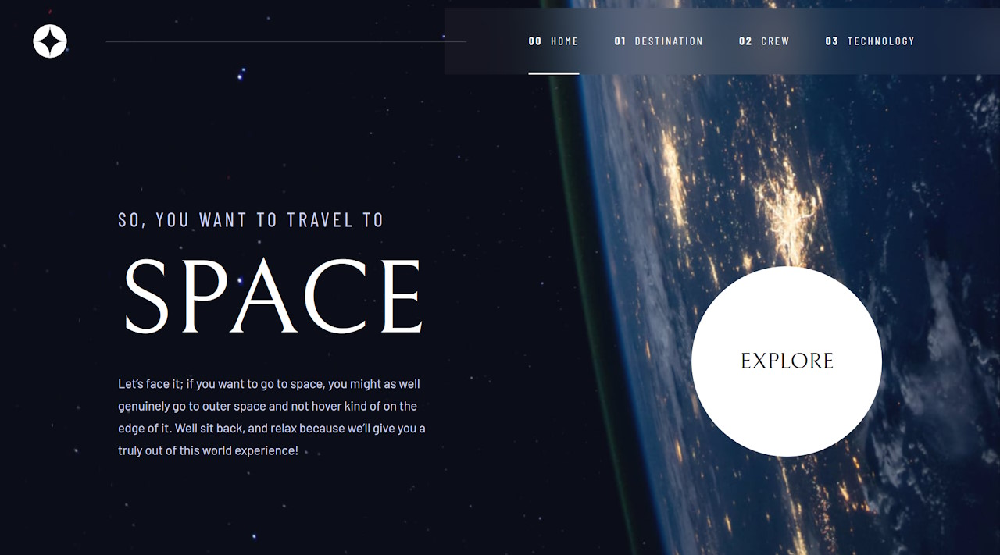

# Frontend Mentor - Space tourism website solution

This is my solution to the [Space tourism website challenge on Frontend Mentor](https://www.frontendmentor.io/challenges/space-tourism-multipage-website-gRWj1URZ3). I completed the design a while ago, but wanted to play with svelte, so used the design to create a full site.

## Table of contents

- [Overview](#overview)
  - [Screenshot](#screenshot)
  - [Links](#links)

## Overview

### Screenshot

### Links

- Solution URL: [https://www.frontendmentor.io/solutions/space-tourism-multipage-website-YAakuS2zyd](https://www.frontendmentor.io/solutions/space-tourism-multipage-website-YAakuS2zyd)
- Live Site URL: [https://space-tourism-svelte.vercel.app/](https://space-tourism-svelte.vercel.app/)
